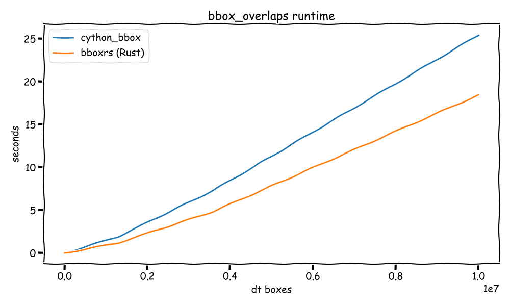

# `bboxrs`

A reimplementation of [`cython_bbox`](https://github.com/samson-wang/cython_bbox) in Rust. It uses the [`pyo3`](https://pyo3.rs/v0.20.3/) crate to interface with Python.

## Installation

```bash
pip install bboxrs
```

## Usage

```python
from bboxrs import bbox_overlaps

import numpy as np

gt = np.random.random((5, 4)).astype(float)
dt = np.random.random((10, 4)).astype(float)

overlaps = bbox_overlaps(dt, gt)
```

**Speed Up**

Looks to be slightly faster than than `cython_bbox` for very large arrays of bounding boxes.


